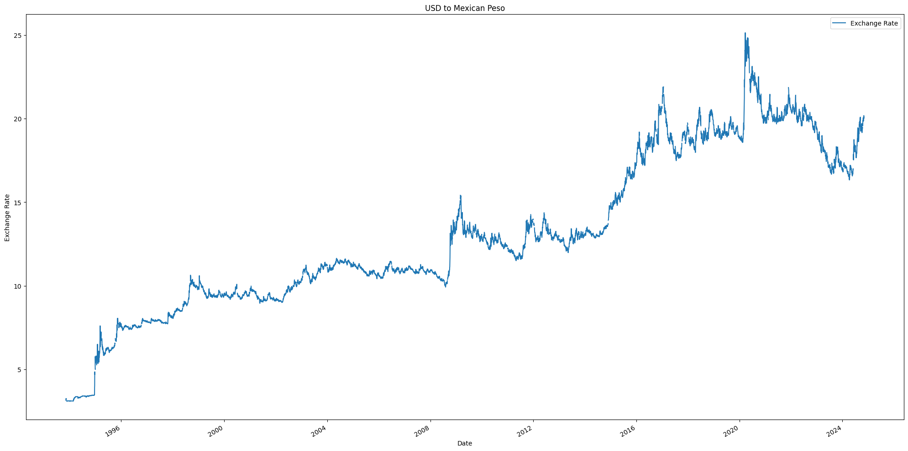

# Foreign Exchange Rate Analysis and Prediction

This project is designed to analyze and predict the exchange rate between USD and MXN (Mexican Peso) using data from the Federal Reserve Economic Data (FRED) API. The project explores multiple economic indicators, performs a linear regression analysis to observe trends, and visualizes the results.

## User Story

Meet **Carlito**, a world traveler planning an exciting trip to Mexico in two weeks. Carlito wants to make the most of his budget and is curious about the USD to MXN exchange rate and potential shifts in the near future.

Our mission is to analyze historical exchange rate data, consider major economic events, and apply predictive models to forecast trends. With these insights, our team of seasoned analysts aims to help Carlito make informed decisions on when to exchange his money for the best possible rate.

## Table of Contents
- [Project Overview](#project-overview)
- [Data Sources](#data-sources)
- [Installation](#installation)
- [Usage](#usage)
- [Methodology](#methodology)
- [Results](#results)
- [Future Work](#future-work)
- [LICENSE](LICENSE) 

## Project Overview

This project addresses a practical challenge: deciding the optimal timing for currency exchange before a trip. Carlito, a U.S. traveler planning a vacation to Mexico, wants to determine whether he should exchange his dollars for pesos now or wait until he arrives in Oaxaca in three months. Since Oaxaca is a smaller city that predominantly operates with cash, Carlito aims to maximize his spending power by understanding the factors that influence the USD to MXN exchange rate.

To guide Carlito’s decision, we conducted a comprehensive analysis of the USD to MXN exchange rate, exploring historical trends, seasonal patterns, and key economic indicators. By leveraging advanced time series forecasting tools and economic data from the Federal Reserve (FRED), we provided him with data-driven insights on exchange rate trends, ultimately helping him make a well-informed choice.

### Goals
1. **Understand Historical Trends**: Examine the long-term trajectory of the USD to MXN exchange rate to provide a historical perspective.
2. **Identify Seasonal Patterns**: Determine if the exchange rate has recurring seasonal shifts, potentially driven by factors like tourism and market demand.
3. **Evaluate Economic Indicators**: Assess how factors such as GDP, inflation, and interest rates correlate with the exchange rate.
4. **Forecast Future Rates**: Using Prophet and other modeling techniques, predict the exchange rate 90 days into the future to advise Carlito on the best exchange timing.

Through this project, we demonstrate how analytical and predictive tools can be applied to a real-world scenario, empowering travelers and investors alike to make informed currency exchange decisions. This approach is repeatable, allowing Carlito to apply similar analysis to other currencies for future travel or investment plans.


## Data Sources

The data is sourced from [FRED (Federal Reserve Economic Data)](https://fred.stlouisfed.org/), a reliable government data source that provides economic data, including:

- **Exchange Rate (DEXMXUS)** - USD to MXN exchange rate.
- **US Federal Funds Rate (FEDFUNDS)** - The benchmark interest rate set by the US Federal Reserve.
- **US 90-Day T-bill Rate (TB3MS)** - Interest rate on 90-day treasury bills.
- **Mexico 90-Day T-bill Rate (INTGSTMXM193N)** - Interest rate on Mexican 90-day treasury bills.
- **US Real GDP (GDPC1)** - Gross Domestic Product of the US, adjusted for inflation.
- **Mexico Real GDP (NGDPRSAXDCMXQ)** - Gross Domestic Product of Mexico, adjusted for inflation.
- **US Inflation Rate (CPIAUCSL)** - Consumer Price Index for All Urban Consumers in the US.
- **Mexico Inflation Rate (MEXCPIALLMINMEI)** - Consumer Price Index for Mexico.
- **US Unemployment Rate (UNRATE)** - The unemployment rate in the United States.
- **Mexico Unemployment Rate (LRUN64TTMXA156N)** - The unemployment rate in Mexico.
- **Oil Prices (DCOILWTICO)** - West Texas Intermediate (WTI) crude oil prices in dollars per barrel.

## Installation

1. **Clone the repository**
   ```bash
   git clone https://github.com/wrdhall3/fx-rate-project.git
   cd fx-rate-project


## Usage

### Run the Notebook
Open and run the `retrieve_fx_data.ipynb` notebook, which contains all code for data retrieval, analysis, and visualization. Ensure that the environment is configured correctly with the required dependencies.

### Data Retrieval and Analysis
- The notebook first retrieves the data from FRED using the API key.
- The economic indicators are then combined into a single DataFrame, with dates aligned to ensure consistency across all time series.

### Plotting and Regression Analysis
- The notebook provides visualization for each economic indicator over time.
- A linear regression model is fitted to the USD to MXN exchange rate to show trends and predict future values.

## Methodology

To forecast the USD to MXN exchange rate and guide Carlito's decision, we employed a systematic approach to analyze historical trends, seasonal patterns, and economic factors. Here’s a breakdown of our methodology:

### 1. **Data Collection and Preparation**
   - We accessed high-quality economic data from the **Federal Reserve Bank of St. Louis (FRED)** API, which provides reliable data on the USD to MXN exchange rate and related economic indicators, including the Fed Funds Rate, T-bill rates, Real GDP, and inflation rates.
   - The data had varying timeframes and frequencies (daily, monthly, and quarterly). We aligned these datasets by resampling and filtering to ensure consistency, using daily data as our primary frequency for the exchange rate and other compatible indicators.

### 2. **Data Cleaning and Processing**
   - **Handling Missing Values**: We identified and managed missing data points, especially in the Mexican economic indicators, by either removing incomplete records or interpolating where appropriate to maintain a continuous time series.
   - **Normalization**: We ensured all datasets aligned with a common timeframe to allow meaningful comparisons, including transforming quarterly data where necessary.

### 3. **Exploratory Data Analysis (EDA)**
   - We began by plotting a 30-year historical trend of the USD to MXN exchange rate to visualize the long-term appreciation of the USD against the MXN. 
   - We then calculated a **linear regression line** to identify the trend direction and establish a baseline forecast for future rates.
   - We calculated a **three-year trailing average** with upper and lower bounds (confidence intervals) to highlight periods of unusual volatility, particularly during significant economic events.

### 4. **Seasonal Analysis with Prophet**
   - Using the **Prophet time series forecasting model**, we detected seasonal trends in the USD to MXN exchange rate, finding that the rate typically depreciates during summer and appreciates in winter, potentially due to tourism-driven currency demand.
   - We generated a 90-day forecast with Prophet to predict the exchange rate three months into the future, aligning with Carlito’s travel plans.

### 5. **Correlation Analysis of Economic Indicators**
   - We conducted a correlation analysis to understand the influence of different economic indicators on the USD to MXN exchange rate. High correlations with GDP (around 0.90) and inflation indicated strong relationships, while moderate correlations with other indicators helped refine our understanding of the rate’s drivers.
   - We visualized these correlations using a heatmap to easily interpret the strength and direction of each factor’s relationship with the exchange rate.

### 6. **Interest Rate Parity (IRP) Calculation**
   - To test the **Interest Rate Parity (IRP) hypothesis**, we calculated a forward exchange rate using the interest rates of US and Mexican 90-day T-bills, then compared it to the actual rate shifted by 90 days.
   - The high correlation between the IRP-predicted rate and the actual exchange rate (approximately 0.95) confirmed the relevance of IRP, albeit with some limitations due to data gaps.

### 7. **Visualization and Final Analysis**
   - We created a series of visualizations to communicate findings effectively, including:
     - A historical exchange rate chart with a regression line for long-term trends.
     - A confidence interval chart to show periods of volatility and economic shocks.
     - Seasonal trends identified by Prophet.
     - A correlation heatmap for economic indicators.
     - A 90-day forecast for Carlito’s trip decision.
   - These visualizations guided Carlito’s final decision, providing both historical perspective and predictive insights.

By following this structured methodology, we equipped Carlito with a data-driven approach to make his currency exchange decision confidently, offering him a repeatable process for analyzing future travel-related currency exchanges.


## Results

### Key Findings

- **Historical Trend**: Our analysis using a linear regression model reveals a steady upward trend in the USD to MXN exchange rate over the past 30 years, indicating a general appreciation of the USD against the MXN over time.

- **Economic Shocks and Safe-Haven Status**: During periods of global economic uncertainty, such as the 2020 COVID-19 crisis, the USD strengthened significantly against the MXN as it acted as a "safe haven" currency. This led to noticeable spikes in the exchange rate during these times.

- **Confidence Intervals**: By plotting a trailing average with upper and lower confidence intervals, we observed that when the exchange rate exceeds these bounds, it signals unusual volatility, often triggered by economic shocks.

- **Seasonal Patterns**: The Prophet time series forecasting model reveals seasonal trends, with the USD typically depreciating in the summer and appreciating in the winter. This pattern may be influenced by the increased volume of American tourists visiting Mexico in the summer months.

### Correlation with Economic Indicators

### Correlation with Economic Indicators

The correlation analysis reveals significant associations between the USD/MXN exchange rate and various economic indicators:

- **Growth and Inflation**: The exchange rate exhibits strong positive correlations with both **US and Mexico Real GDP** (correlation coefficients of 0.90 and 0.87, respectively) and inflation rates (**US CPI** at 0.83 and **MX CPI** at 0.89). These strong correlations suggest that economic growth and inflation rates in both countries are positively associated with the USD/MXN exchange rate.

- **Interest Rates**: **US interest rates** (Federal Funds Rate and 90-Day T-bill Rate) are highly correlated with each other (0.99) and show moderate negative correlations with the exchange rate (-0.27 and -0.21, respectively), indicating an inverse relationship where higher US interest rates tend to be associated with a lower USD/MXN rate. In contrast, **Mexico’s 90-Day T-bill Rate** shows a weak positive correlation with the exchange rate (0.04), suggesting minimal influence.

- **Unemployment**: Both **US and Mexico unemployment rates** display moderate negative correlations with the exchange rate (-0.46), indicating that increases in unemployment rates tend to coincide with a depreciation of the USD relative to the MXN.

- **Oil Prices**: **Oil prices** have a weak negative correlation with the exchange rate (-0.29), suggesting that fluctuations in oil prices have limited direct association with changes in the USD/MXN exchange rate.

This analysis highlights that economic growth, inflation, and US interest rates have the most substantial associations with the USD/MXN exchange rate, while unemployment and oil prices show more moderate or weak correlations.


### Additional Insights

- **Interest Rate Parity (IRP)**: Our exploration of Interest Rate Parity (IRP) suggests that the currency of the country with a higher interest rate tends to depreciate over time. We found a high correlation (approximately 0.95) between the predicted IRP rate and the actual exchange rate, though accuracy could improve with enhanced data on Mexico's long-term interest rates.

- **90-Day Prediction**: Prophet’s 90-day forecast indicates a slight potential decline in the USD/MXN rate, aligning with Carlito’s decision to exchange his money now rather than waiting, anticipating a potential depreciation of the USD.


### Conclusion

Based on the historical analysis, seasonal patterns, correlation with economic indicators, and the Prophet model's forecast, Carlito decided to exchange his USD for MXN at the current rate. The data suggests that the USD may depreciate in the next 90 days, making it favorable for Carlito to act now.

With this comprehensive approach, Carlito now feels confident in making informed foreign exchange decisions, whether for his upcoming trip to Oaxaca or future travels. He could also consider building a mobile app to leverage real-time exchange rate insights, empowering travelers with timely data for currency decisions.


# Visualizations

In our analysis of the USD to MXN exchange rate and its relationship with economic indicators, we’ve created a series of visualizations to help understand key patterns and trends. Each visualization plays an essential role in illustrating the insights derived from our data. Below, we outline each chart's purpose and highlight important observations.

---

## 1. USD to MXN Exchange Rate Over Time



**Purpose**: This line chart shows the trend of the USD to MXN exchange rate over the years, helping us identify periods of appreciation or depreciation in the USD relative to the MXN.

**Observations**: Notable increases or decreases in the exchange rate often correspond with major global or economic events. Identifying these events helps us understand the forces behind currency value changes.

---

## 2. Linear Regression Line on Exchange Rate


**Purpose**: This chart features a linear regression line overlaid on the exchange rate data points, indicating the overall trend direction over time.

**Observations**: The regression line shows a general trend in the exchange rate. Deviations from this line can signal periods of volatility or unusual economic behavior.

---

## 3. Moving Averages with ±2 Standard Deviations


**Purpose**: This chart displays a 3-year moving average along with upper and lower bounds set at ±2 standard deviations. This range shows typical fluctuations around the average rate.

**Observations**: The exchange rate generally stays within these bands, but periods where it crosses the bounds indicate high volatility. These instances often align with significant economic events.

---

## 4. Correlation Matrix Heatmap


**Purpose**: The heatmap shows the correlation between the exchange rate and various economic indicators such as GDP, inflation, and interest rates.

**Observations**: Strong correlations, particularly with GDP and CPI (inflation), suggest that these factors play a significant role in influencing the exchange rate. Understanding these relationships can improve predictive models.

---

## 5. Interest Rate Parity (IRP) Comparison


**Purpose**: This chart compares the actual exchange rate with the forward rate calculated using Interest Rate Parity (IRP). This comparison helps evaluate IRP’s effectiveness in forecasting currency movements.

**Observations**: Periods where the actual exchange rate diverges from the IRP prediction can reveal times when other economic factors outweigh interest rate differences between the U.S. and Mexico.

---

## 6. Prophet Forecast from 2014 to Present


**Purpose**: Using Prophet’s forecasting model, this chart shows the projected exchange rate trend from 2014 onward, with a confidence interval.

**Observations**: The model captures the general trend, but some deviations suggest occasional volatility that may be difficult to forecast accurately. This provides a solid basis for long-term predictions.

---

## 7. Prophet Forecasts for Different Time Windows

- **7-Year Forecast from 2018**
- **3-Year Forecast from 2022**
- **1-Year Forecast from 2024**

**Purpose**: These charts offer Prophet’s forecasts based on different historical data windows. Each timeframe helps us test the model’s reliability over various periods.

**Observations**: Shorter timeframes may offer more accurate recent predictions, while longer timeframes can capture more stable, long-term trends.

---

## 8. Best Case, Worst Case, and Most Likely Exchange Rate Scenarios


**Purpose**: This visualization outlines three possible scenarios for the exchange rate over the next 90 days: best case, worst case, and most likely.

**Observations**: The range between best and worst cases highlights uncertainty. A wider range suggests potential volatility, which could be critical for planning financial decisions.

---

## 9. Prophet Forecast Components


**Purpose**: Prophet’s components plot breaks down the forecast into trend, weekly, and yearly seasonal effects. This helps us understand the factors that influence the forecasted exchange rate.

**Observations**: Recognizable seasonal patterns and an overall trend can provide insights into when the exchange rate is likely to experience predictable shifts.

---

Together, these visualizations give us a comprehensive view of the factors affecting the USD to MXN exchange rate. By observing trends, seasonal patterns, and the impact of economic indicators, we gain valuable insights into currency movements and the overall economic relationship between the U.S. and Mexico.


### Statistical Summary

In our linear regression analysis, the **slope** and **intercept** are key components of the regression line equation \( y = mx + b \), where:

- **Slope (0.00134)**: This value represents the change in the USD to MXN exchange rate for each additional unit of time. The positive slope suggests a slight upward trend in the exchange rate over time, indicating that, on average, the USD strengthens against the MXN as time progresses.
  
- **Intercept (-973.3058)**: This is the theoretical exchange rate value when time is zero. Although time cannot realistically be zero in this context, the intercept provides a starting point for the regression line.

The resulting equation from this model, where *Time* is represented as an ordinal date, is:

**Exchange Rate = 0.00134 × Time (Ordinal Date) - 973.3058**


### Model Metrics
- **R-squared (0.883)**: This high value indicates that approximately 88.3% of the variance in the exchange rate can be explained by the progression of time in this model. A higher R-squared value suggests that the model is a good fit for the data.
  
- **P-value (0.0)**: This value demonstrates that the relationship between time and the exchange rate is statistically significant. A low p-value provides strong evidence against the null hypothesis (that there is no relationship), confirming the reliability of the slope.
  
- **Standard Error (5.56e-06)**: This reflects the precision of the slope estimate. A smaller standard error indicates a more precise slope estimate, enhancing confidence in the results.

### Example Prediction
Using this regression line equation, we can estimate the future exchange rate. For example, the predicted exchange rate in 90 days is approximately **20.7449**, calculated as:

```python
predicted_y = slope * x_90_days_later + intercept
```


## Future Opportunities

As we look to scale and enhance our exchange rate prediction model, we see several promising opportunities for expansion, both in terms of model complexity and accessibility to a broader audience. Our future work will build on the current foundation by incorporating additional features, exploring new predictive models, and making the tool accessible to diverse users, from travelers to financial analysts. Below are the key areas we aim to explore:

### 1. Expanding to Other Currencies
While our current focus is on the USD-MXN exchange rate, expanding to other currency pairs is a natural progression. By incorporating additional currency pairs, we could roll out the model to a wider range of local and international businesses, helping them navigate currency fluctuations. This expansion would require retraining the model for each currency pair, but it could establish our product as a valuable tool for managing exchange rate risk across multiple markets. Businesses operating in import/export sectors, or individuals planning international travel, could use this tool to make informed decisions based on predicted currency trends.

### 2. On-Demand Forecasting for the General Public
Releasing the product to the general public with real-time forecasting capabilities could make it a valuable resource for a wide audience, including travelers, expatriates, and casual investors. Adding real-time monitoring of stock market and currency trends would allow users to access up-to-date information and predictions tailored to their needs. This would make the tool versatile, offering on-demand forecasts that adapt to market conditions and help users make timely decisions. Additionally, we could explore partnerships with travel agencies, financial services, and remittance platforms to broaden the tool’s reach and application.

### 3. Building a User-Friendly App
A dedicated app could take the user experience to the next level by providing personalized, interactive features tailored to different user groups. Through the app, travelers could set alerts for favorable exchange rates, investors could monitor currency movements in relation to economic events, and financial analysts could access detailed reports on currency trends. We envision the app as an interactive tool that not only delivers forecasts but also educates users on the factors influencing exchange rates. Feedback gathered from the app’s users would guide further improvements, ensuring the tool remains relevant and valuable to its audience. This app could also serve as a prototype for future expansion into predictive analytics for other financial markets.

### 4. Enhanced Model Complexity with Multivariate Linear Regression and Additional Indicators
To improve forecast accuracy, we plan to integrate a **multivariable linear regression model** alongside Prophet. This approach will enable the analysis of multiple economic indicators in combination, providing a more nuanced understanding of how factors like inflation, GDP, and interest rates collectively influence the USD to MXN exchange rate. By expanding our model complexity, we aim to capture a wider range of economic dynamics, enhancing the precision of our predictions.

### 5. Automating Model and Data Updates for Real-Time Insights
To maintain the model’s relevance and accuracy, we plan to implement an automated pipeline for ongoing data collection, preprocessing, and model retraining. This system will support real-time insights and include the following components:

- **Automated Data Collection**: Schedule API calls to gather up-to-date data from sources such as FRED, CPI databases, and global financial markets. This automated retrieval will keep the model aligned with the latest economic developments.
- **Data Preprocessing and Feature Engineering**: Establish an automated pipeline for data cleaning, transformation, and feature engineering. This ensures consistency and accuracy, even as new data flows into the model.
- **Regular Model Retraining**: Retraining the model at regular intervals (e.g., monthly or quarterly) will enable it to stay current with market trends, making forecasts more dependable.
- **Performance Monitoring and Alerts**: A monitoring system will track forecast accuracy and issue alerts for any significant deviations, allowing for timely adjustments and improvements.
- **Real-Time Forecast Dashboard**: We aim to build a dashboard for displaying real-time forecasts and key insights, which could eventually be expanded into an app for broader accessibility.

### Summary
In summary, our future developments include expanding the model to analyze additional currencies, providing real-time forecasts on demand, building a dedicated app, enhancing model complexity with multivariable regression, and automating updates for seamless, up-to-date insights. These advancements will make our product valuable and accessible to a broad audience—from travelers and investors to businesses and financial analysts. Ultimately, we envision a powerful, user-friendly tool that offers reliable exchange rate forecasts and actionable insights across diverse economic scenarios.


## License
This project is licensed under the MIT License. See the [LICENSE](LICENSE) file for details.

