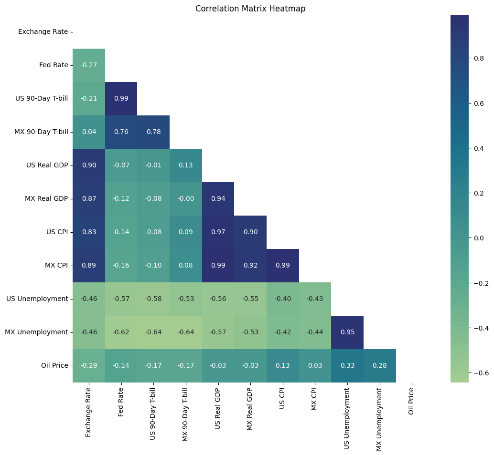

# Foreign Exchange Rate Analysis and Prediction

This project is designed to analyze and predict the exchange rate between USD and MXN (Mexican Peso) using data from the Federal Reserve Economic Data (FRED) API. The project explores multiple economic indicators, performs a linear regression analysis to observe trends, and visualizes the results.

## Table of Contents
- [User Story](#user-story)
- [Project Overview](#project-overview)
- [Goals](#goals)
- [Data Sources](#data-sources)
- [Installation](#installation)
- [Usage](#usage)
- [Methodology](#methodology)
- [Hypotheses and Expected Findings](#hypotheses-and-expected-findings)
- [Experimental Approach and Key Observations](#experimental-approach-and-key-observations)
- [Statistical Summary and Predictive Model Setup](#statistical-summary-and-predictive-model-setup)
- [Visualizations](#visualizations)
- [Analysis-Driven Recommendations](#analysis-driven-recommendations)
- [Future Opportunities](#future-opportunities)
- [License](#license)

---

## User Story

Meet **Carlito**, a world traveler planning an exciting trip to Mexico in two weeks. Carlito wants to make the most of his budget and is curious about the USD to MXN exchange rate and potential shifts in the near future.

Our mission is to analyze historical exchange rate data, consider major economic events, and apply predictive models to forecast trends. With these insights, our team of seasoned analysts aims to help Carlito make informed decisions on when to exchange his money for the best possible rate.

## Project Overview

This project addresses a practical challenge: deciding the optimal timing for currency exchange before a trip. Carlito, a U.S. traveler planning a vacation to Mexico, wants to determine whether he should exchange his dollars for pesos now or wait until he arrives in Oaxaca in three months.

To guide Carlito’s decision, we conducted a comprehensive analysis of the USD to MXN exchange rate, exploring historical trends, seasonal patterns, and key economic indicators. By leveraging advanced time series forecasting tools and economic data from the Federal Reserve (FRED), we provided him with data-driven insights on exchange rate trends, ultimately helping him make a well-informed choice.

## Goals

1. **Understand Historical Trends**
2. **Identify Seasonal Patterns**
3. **Evaluate Economic Indicators**
4. **Forecast Future Rates**

---

## Data Sources

The data is sourced from [FRED (Federal Reserve Economic Data)](https://fred.stlouisfed.org/), a reliable government data source that provides economic data, including:

- **Exchange Rate (DEXMXUS)** - USD to MXN exchange rate.
- **US Federal Funds Rate (FEDFUNDS)** - The benchmark interest rate set by the US Federal Reserve.
- **US 90-Day T-bill Rate (TB3MS)** - Interest rate on 90-day treasury bills.
- **Mexico 90-Day T-bill Rate (INTGSTMXM193N)** - Interest rate on Mexican 90-day treasury bills.
- **US Real GDP (GDPC1)** - Gross Domestic Product of the US, adjusted for inflation.
- **Mexico Real GDP (NGDPRSAXDCMXQ)** - Gross Domestic Product of Mexico, adjusted for inflation.
- **US Inflation Rate (CPIAUCSL)** - Consumer Price Index for All Urban Consumers in the US.
- **Mexico Inflation Rate (MEXCPIALLMINMEI)** - Consumer Price Index for Mexico.
- **US Unemployment Rate (UNRATE)** - The unemployment rate in the United States.
- **Mexico Unemployment Rate (LRUN64TTMXA156N)** - The unemployment rate in Mexico.
- **Oil Prices (DCOILWTICO)** - West Texas Intermediate (WTI) crude oil prices in dollars per barrel.

---

## Installation

1. **Clone the repository**
   ```bash
   git clone https://github.com/wrdhall3/fx-rate-project.git
   cd fx-rate-project


## Usage

### Run the Notebook
Open and run the `retrieve_fx_data.ipynb` notebook, which contains all code for data retrieval, analysis, and visualization. Ensure that the environment is configured correctly with the required dependencies.

### Data Retrieval and Analysis
- The notebook first retrieves the data from FRED using the API key.
- The economic indicators are then combined into a single DataFrame, with dates aligned to ensure consistency across all time series.

### Plotting and Regression Analysis
- The notebook provides visualization for each economic indicator over time.
- A linear regression model is fitted to the USD to MXN exchange rate to show trends and predict future values.

## Methodology

To forecast the USD to MXN exchange rate and guide Carlito's decision, we employed a systematic approach to analyze historical trends, seasonal patterns, and economic factors. Here’s a breakdown of our methodology:

### 1. **Data Collection and Preparation**
   - We accessed high-quality economic data from the **Federal Reserve Bank of St. Louis (FRED)** API, which provides reliable data on the USD to MXN exchange rate and related economic indicators, including the Fed Funds Rate, T-bill rates, Real GDP, and inflation rates.
   - The data had varying timeframes and frequencies (daily, monthly, and quarterly). We aligned these datasets by resampling and filtering to ensure consistency, using daily data as our primary frequency for the exchange rate and other compatible indicators.

### 2. **Data Cleaning and Processing**
   - **Handling Missing Values**: We identified and managed missing data points, especially in the Mexican economic indicators, by either removing incomplete records or interpolating where appropriate to maintain a continuous time series.
   - **Normalization**: We ensured all datasets aligned with a common timeframe to allow meaningful comparisons, including transforming quarterly data where necessary.

### 3. **Exploratory Data Analysis (EDA)**
   - We began by plotting a 30-year historical trend of the USD to MXN exchange rate to visualize the long-term appreciation of the USD against the MXN. 
   - We then calculated a **linear regression line** to identify the trend direction and establish a baseline forecast for future rates.
   - We calculated a **three-year trailing average** with upper and lower bounds (confidence intervals) to highlight periods of unusual volatility, particularly during significant economic events.

### 4. **Seasonal Analysis with Prophet**
   - Using the **Prophet time series forecasting model**, we detected seasonal trends in the USD to MXN exchange rate, finding that the rate typically depreciates during summer and appreciates in winter, potentially due to tourism-driven currency demand.
   - We generated a 90-day forecast with Prophet to predict the exchange rate three months into the future, aligning with Carlito’s travel plans.

### 5. **Correlation Analysis of Economic Indicators**
   - We conducted a correlation analysis to understand the influence of different economic indicators on the USD to MXN exchange rate. High correlations with GDP (around 0.90) and inflation indicated strong relationships, while moderate correlations with other indicators helped refine our understanding of the rate’s drivers.
   - We visualized these correlations using a heatmap to easily interpret the strength and direction of each factor’s relationship with the exchange rate.

### 6. **Interest Rate Parity (IRP) Calculation**
   - To test the **Interest Rate Parity (IRP) hypothesis**, we calculated a forward exchange rate using the interest rates of US and Mexican 90-day T-bills, then compared it to the actual rate shifted by 90 days.
   - The high correlation between the IRP-predicted rate and the actual exchange rate (approximately 0.98) confirmed the relevance of IRP, albeit with some limitations due to data gaps.

### 7. **Visualization and Final Analysis**
   - We created a series of visualizations to communicate findings effectively, including:
     - A historical exchange rate chart with a regression line for long-term trends.
     - A confidence interval chart to show periods of volatility and economic shocks.
     - Seasonal trends identified by Prophet.
     - A correlation heatmap for economic indicators.
     - A 90-day forecast for Carlito’s trip decision.
   - These visualizations guided Carlito’s final decision, providing both historical perspective and predictive insights.

By following this structured methodology, we equipped Carlito with a data-driven approach to make his currency exchange decision confidently, offering him a repeatable process for analyzing future travel-related currency exchanges.


## Hypotheses and Expected Findings

Our analysis investigates the primary economic drivers behind the USD to MXN exchange rate, focusing on potential correlations with GDP, inflation, seasonal trends, and interest rate differences. By rigorously testing each of these economic factors, we aim to provide actionable insights into optimal timing for currency exchange decisions.

### Research Expectations

This study aims to answer several core questions:

1. **Long-Term Trend of USD/MXN Appreciation**: We expect to find a long-term appreciation trend for USD against MXN, potentially due to differences in economic growth and inflation between the U.S. and Mexico. This hypothesis suggests that the USD has strengthened against the MXN over time, influenced by relative economic stability and growth disparity.

2. **Market Response to Economic Shocks**: We anticipate that periods of economic uncertainty will lead to USD appreciation as a "safe-haven" currency. We expect to observe spikes in the USD/MXN rate during crises, such as the 2008 financial recession and the 2020 COVID-19 pandemic, as investors turn to the USD for stability. This behavior should reveal patterns of exchange rate volatility linked to global or regional economic disruptions.

3. **Seasonal Exchange Rate Patterns**: We hypothesize that the USD/MXN exchange rate will exhibit seasonal variations, with a pattern of appreciation during winter months and depreciation in summer. This seasonal effect may be partly driven by shifts in tourism-related demand, where summer sees increased peso demand from American tourists.

4. **Correlation with Key Economic Indicators**: We aim to understand how various economic indicators, such as GDP, inflation, interest rates, and oil prices, influence the USD/MXN exchange rate. By examining these relationships, we hope to identify which factors are most closely linked to exchange rate fluctuations.

---

### Experimental Approach and Key Observations

Our methodology includes gathering historical exchange rate data along with relevant economic indicators from the Federal Reserve Economic Data (FRED) API, followed by rigorous analysis. Below are the key observations derived from our hypotheses:

#### 1. **Expected Long-Term USD/MXN Appreciation**
   - **Hypothesis**: The USD will exhibit a consistent long-term appreciation trend against the MXN.
   - **Expected Finding**: A positive trend in the USD/MXN rate over time, suggesting the USD's overall strengthening.
   - **Observation**: The linear regression analysis confirms a gradual upward trend in the USD/MXN rate over 30 years, indicating that the USD has appreciated against the MXN. This trend likely reflects economic disparities and higher growth rates in the U.S. relative to Mexico.

#### 2. **Market Reaction to Economic Shocks as a Safe-Haven Currency**
   - **Hypothesis**: During global or regional economic crises, the USD/MXN exchange rate will show significant spikes, with the USD appreciating as a safe-haven currency.
   - **Expected Finding**: Notable USD/MXN exchange rate increases during periods like the 2008 financial crisis and the COVID-19 pandemic.
   - **Observation**: The USD/MXN rate shows clear spikes corresponding to the 2008 financial crisis and the 2020 pandemic, supporting the hypothesis that investors view the USD as a refuge in times of uncertainty. This aligns with the role of the USD as a stabilizing currency during market stress.

#### 3. **Seasonal Trends in Exchange Rate Behavior**
   - **Hypothesis**: The USD/MXN exchange rate experiences seasonal trends, appreciating in winter and depreciating in summer due to fluctuating demand.
   - **Expected Finding**: A seasonal pattern showing a strengthened USD in winter months and a weaker USD in summer, potentially linked to tourism demand.
   - **Observation**: Time series analysis with the Prophet model reveals a repeating seasonal pattern, with the USD generally appreciating during winter and weakening in summer. This seasonal trend supports the hypothesis and may reflect increased tourism-driven demand for the peso in summer.

#### 4. **Correlations Between USD/MXN Exchange Rate and Economic Indicators**

   - **Growth and Inflation Correlation**: 
      - **Hypothesis**: High economic growth and inflation in either country will correlate positively with the USD/MXN exchange rate.
      - **Expected Finding**: Strong positive correlations between the USD/MXN rate and both U.S. and Mexican GDP and inflation rates.
      - **Observation**: Strong correlations were observed between the USD/MXN rate and real GDP as well as inflation in both countries, supporting our hypothesis. High GDP and inflation values are associated with exchange rate fluctuations, likely reflecting increased economic activity and currency demand shifts.

   - **Interest Rate Differential**:
      - **Hypothesis**: The USD/MXN rate will correlate moderately with interest rates, with higher U.S. interest rates strengthening the USD by attracting foreign investment.
      - **Expected Finding**: Moderate correlation of U.S. interest rates with the exchange rate, with weaker influence from Mexico’s interest rates.
      - **Observation**: The analysis shows moderate negative correlations between U.S. interest rates (Federal Funds Rate and 90-Day T-bill Rate) and the USD/MXN rate, indicating that higher U.S. rates tend to strengthen the USD. Mexico’s interest rate showed only a weak positive correlation, suggesting that U.S. monetary policy exerts a stronger influence on the exchange rate.

   - **Unemployment Rate Influence**:
      - **Hypothesis**: Higher unemployment rates will correlate with a stronger USD, as weaker economic conditions reduce demand for the MXN.
      - **Expected Finding**: Moderate negative correlations between the USD/MXN rate and unemployment rates in both countries.
      - **Observation**: The data confirms moderate negative correlations between unemployment rates and the exchange rate, suggesting that higher unemployment corresponds with a weaker peso, aligning with expectations.

   - **Oil Prices**:
      - **Hypothesis**: Given Mexico’s role as an oil exporter, higher oil prices should positively influence the peso, reducing the USD/MXN exchange rate.
      - **Expected Finding**: Positive correlation between oil prices and MXN strength, indicated by a negative correlation with the USD/MXN rate.
      - **Observation**: Surprisingly, oil prices exhibit only a weak negative correlation with the USD/MXN exchange rate. This suggests that while oil prices may impact the MXN, other factors such as inflation and GDP growth appear to play a larger role in exchange rate determination.

---

### Summary of Findings and Next Steps

Our hypotheses regarding the exchange rate’s sensitivity to economic indicators, interest rates, and seasonal trends are largely confirmed by the data. The USD exhibits an appreciating trend against the MXN, driven by economic growth disparities and inflation rates. Seasonal trends and the USD’s safe-haven role during crises are also validated.

Moving forward, we aim to refine these insights with more advanced modeling, exploring multivariate analysis to capture more nuanced effects of economic indicators on the USD/MXN rate. This approach will allow us to enhance the precision of our currency exchange timing recommendations and provide a more comprehensive view of exchange rate dynamics for users like Carlito.


### Statistical Summary and Predictive Model Setup

To quantify the long-term trend, we applied a linear regression model with a **slope** of 0.00134 and an **intercept** of -973.3058, resulting in the equation:

**Exchange Rate = 0.00134 × Time (Ordinal Date) - 973.3058**

The model yields an **R-squared** value of 0.883, indicating that 88.3% of the variance in the exchange rate can be explained by time, with a statistically significant **p-value** of 0.0. This aligns with our hypothesis of a steady upward trend. However, the model's limitations in forecasting deviations caused by short-term shocks prompt us to incorporate additional variables.

### Example Prediction

Using the regression model, we hypothesize that in 90 days, the exchange rate will be approximately 20.7449, calculated as:

```python
predicted_y = slope * x_90_days_later + intercept
```


## Visualizations
[Back to Top](#table-of-contents)

In our analysis of the USD to MXN exchange rate and its relationship with economic indicators, we’ve created a series of visualizations to help understand key patterns and trends. Each visualization plays an essential role in illustrating the insights derived from our data. Below, we outline each chart's purpose and highlight important observations.

---

## 1. USD to MXN Exchange Rate Over Time


**Purpose:** This line chart displays the historical trend of the USD to MXN exchange rate, highlighting periods of appreciation and depreciation of the USD relative to the MXN.

**Observations:** Initial observations of the 30-year data reveal periods of high volatility in the USD to MXN exchange rate. Significant fluctuations appear at various points, suggesting potential influences from global or economic events. We also observe a general upward trend in the USD to MXN rate over time, with the exchange rate moving from approximately 5 pesos per dollar to around 20 pesos per dollar and reaching as high as 25 pesos in 2020. This peak in 2020 especially catches our interest, prompting us to investigate that time period further to understand the factors driving such volatility.


---

## 2. Linear Regression Line on Exchange Rate


**Purpose:** This chart features a linear regression line overlaid on the exchange rate data points, indicating the overall trend direction over time.

**Observations:** We applied a linear regression model to predict the USD to MXN exchange rate. However, as we can see, this model may not be entirely effective for long-term forecasting, as it suggests a continuous upward trend in the distant future. Such a trend would imply an indefinite appreciation of the USD against the MXN, which may not reflect realistic economic conditions over extended periods. In the short term, though, this model could help anticipate a gradual increase in the exchange rate, albeit with some skepticism due to the model’s limitations in capturing potential reversals or volatility from external economic factors.

---

## 3. Moving Averages with ±2 Standard Deviations


**Purpose:** This chart displays a 3-year moving average along with upper and lower bounds set at ±2 standard deviations. This range shows typical fluctuations around the average rate.

**Observations:** As economic advisors, we identified areas of high volatility in the exchange rate and selected these periods for further analysis. We added timestamps based on major economic events, such as the Asian Financial Crisis, the Global Recession of 2008, and the COVID-19 pandemic in 2020. Large spikes in the USD to MXN exchange rate during these times suggest that the US dollar acts as a "safe haven" during global economic shocks. This pattern highlights how investors often turn to the USD during periods of uncertainty, leading to temporary but significant increases in the exchange rate.


---

## 4. Correlation Matrix Heatmap



**Purpose:** The heatmap shows the correlation between the exchange rate and various economic indicators, such as GDP, inflation, and interest rates.

**Observations**

The correlation matrix provides a comprehensive view of the relationships between the USD to MXN exchange rate and various economic indicators. As economic advisors, we interpret these correlations to identify which factors have the most substantial impact on the exchange rate and which are less influential. Here are the key insights from the heatmap:

1. **High Positive Correlations with GDP and Inflation:**
   - **US Real GDP** (0.90) and **Mexico Real GDP** (0.87) show a strong positive correlation with the exchange rate, indicating that economic growth in both countries has a significant impact on currency value. When the GDP of either country rises, the exchange rate tends to increase, reflecting stronger economic conditions and potentially increased trade and investment flows.
   - **US CPI (Inflation)** (0.83) and **Mexico CPI (Inflation)** (0.89) are also highly correlated with the exchange rate, highlighting the role of inflation in shaping currency values. High inflation in either country can erode purchasing power, affecting the demand for each currency and thereby influencing the exchange rate.

2. **Interest Rates and Exchange Rate:**
   - The **US Federal Funds Rate** (-0.27) and **US 90-Day T-bill Rate** (-0.21) exhibit moderate negative correlations with the exchange rate. This suggests that higher US interest rates are associated with a slightly lower USD to MXN exchange rate, possibly because higher US interest rates can attract foreign investment, strengthening the USD relative to the MXN.
   - **Mexico’s 90-Day T-bill Rate** has a very weak correlation with the exchange rate (0.04), indicating that short-term interest rates in Mexico have minimal direct impact on the USD to MXN exchange rate. This weak relationship could be due to other dominant factors, such as Mexico’s economic performance relative to the US or global investor sentiment favoring the USD as a safe haven.

3. **Unemployment Rates and Exchange Rate:**
   - Both **US Unemployment** (-0.46) and **Mexico Unemployment** (-0.46) have moderate negative correlations with the exchange rate. This suggests that higher unemployment rates in either country are generally associated with a stronger USD relative to the MXN. High unemployment can indicate economic weakness, which might reduce the attractiveness of that country's currency, favoring the USD as a more stable option.

4. **Oil Prices:**
   - **Oil prices** exhibit a weak negative correlation with the USD to MXN exchange rate (-0.29). While Mexico is a major oil exporter, fluctuations in oil prices appear to have a limited direct impact on the exchange rate in this dataset. This weak relationship may indicate that other economic factors, such as inflation and GDP, play more critical roles in determining the exchange rate than oil prices alone.

5. **Interrelationships Among US and Mexico Economic Indicators:**
   - The high correlation between **US Real GDP** and **Mexico Real GDP** (0.94) reflects the close economic ties between the two countries, particularly through trade and investment. This interdependence means that economic performance in one country often influences the other.
   - **US and Mexico CPI** also have a high correlation (0.92), suggesting that inflationary pressures in one country tend to mirror those in the other, likely due to their interconnected economies and shared exposure to global economic conditions.

### Summary:
In summary, **GDP and inflation** are the primary drivers of the USD to MXN exchange rate, with strong positive correlations indicating their significant impact on currency values. **Interest rates** and **unemployment rates** show moderate correlations, suggesting they also influence the exchange rate but to a lesser extent. **Oil prices** have a minor role, indicating limited direct impact on the exchange rate despite Mexico's role as an oil-exporting nation. This analysis allows us to focus on the most influential variables—GDP and inflation—while being mindful of other factors that can indirectly affect the exchange rate, especially during periods of economic volatility.


---

## 5. Interest Rate Parity (IRP) Comparison


**Purpose:** This chart compares the actual exchange rate with the forward rate calculated using Interest Rate Parity (IRP). This comparison helps evaluate IRP’s effectiveness in forecasting currency movements.

**Observations:** The graph displays the USD to MXN exchange rate (in blue) alongside the 90-day forward rate shifted (in red), calculated using the Interest Rate Parity (IRP) approach. The high correlation between these two lines, with a correlation coefficient of approximately 0.98, suggests that IRP is quite effective in capturing short-term movements in the exchange rate. The close alignment over the years highlights the influence of interest rate differentials on the exchange rate in the short term, indicating that investors' expectations based on interest rate parity align with actual market behavior.

However, while the IRP model works well for short-term predictions, certain limitations become apparent over longer periods. For example, we observe deviations during periods of significant economic turbulence, such as the 2008 global financial crisis and the COVID-19 pandemic in 2020. During these times, the exchange rate and forward rate diverge, illustrating that the IRP model does not fully capture the impact of global economic shocks or market sentiment, which can override interest rate effects in the short term.

Additionally, the reliability of the IRP model is constrained by data quality, especially when using long-term rates like the 10-year Mexican T-bill rate, which proved inconsistent. In practice, IRP requires precise and stable interest rate data for accurate forecasting. These observations suggest that while IRP can be a powerful tool for short-term forecasting, its applicability diminishes with longer forecasting horizons or in times of economic uncertainty when other factors may play a more significant role.

Overall, this graph demonstrates that the USD tends to strengthen against the MXN in line with short-term interest rate differentials. However, reliance solely on IRP may be risky for long-term predictions or in unstable market conditions, highlighting the importance of supplementing IRP analysis with additional economic factors.


---

## Prophet Forecasts

---

### 6. 7-Year Forecast from 2018


**Purpose:** This 7-year Prophet forecast from 2018 provides insight into the model’s capability for long-term trend identification and seasonal pattern recognition.

**Observations:** While the 7-year forecast captures broad seasonal trends, it struggles to accurately predict short-term spikes caused by economic events like the COVID-19 pandemic, where a significant deviation from the trend occurred. This limitation highlights Prophet’s difficulty in adapting to sudden economic shocks. Given its reliance on seasonal and trend-based data, the model performs better in stable environments and less so during high-volatility periods. For immediate needs, such as Carlito’s plan to exchange currency, Prophet may underestimate potential gains due to current favorable seasonal conditions. The findings suggest Carlito should capitalize on the current winter season rather than waiting, as short-term models may offer more actionable insights in volatile markets.

---

### 7. Best Case, Worst Case, and Most Likely Exchange Rate Scenarios


**Purpose:** This visualization outlines three potential scenarios—best, worst, and most likely—for the exchange rate over the next 70 business days, providing Carlito with a range of possible outcomes.

**Observations:** The 70-business-day forecast reflects the seasonal advantage of winter, where the USD typically appreciates against the MXN. The best-case scenario aligns with this seasonal trend, suggesting a favorable rate if Carlito exchanges his money now. In contrast, the worst-case scenario highlights the risk of waiting, where the rate could become less favorable as seasonal trends shift. Given these projections, Carlito is advised to exchange his currency sooner rather than later to take advantage of the favorable winter exchange rate.

---

### 8. Prophet Forecast Components


**Purpose:** Prophet’s components plot breaks down the forecast into trend, weekly, and yearly seasonal effects. This helps us understand the factors that influence the forecasted exchange rate.

**Observations:** The monthly seasonality component reveals that the winter season generally provides a stronger USD, as demand for pesos decreases. This trend supports Carlito’s plan to exchange his dollars during the winter months to get a higher return, as the MXN tends to be relatively weaker. Therefore, it’s recommended for Carlito to exchange his money now to capitalize on this seasonal advantage, rather than risking potential depreciation of the USD over the next 90 days.


---

### Analysis-Driven Recommendations

Our analysis of the USD to MXN exchange rate, coupled with insights from historical data, seasonal trends, and economic indicators, leads us to a clear recommendation: Carlito should proceed with exchanging his USD to MXN now, rather than waiting. The data reveals several interconnected factors that make this timing optimal:

1. **Seasonal Advantage in Winter**: The Prophet model's seasonal component analysis indicates that the USD typically strengthens against the MXN during winter months. This seasonal trend, driven by lower demand for pesos and other economic behaviors specific to this time of year, creates a more favorable exchange rate environment for converting USD to MXN. By acting now, Carlito stands to benefit from this seasonal strength, capturing a rate that may not be as favorable in a few months, particularly as we enter spring when demand for pesos might increase.

2. **Limitations of Long-Term Forecasting in Volatile Markets**: While the Prophet model is useful for capturing broad trends and identifying regular seasonal patterns, it is less effective at predicting short-term fluctuations caused by sudden economic shocks. Events like the COVID-19 pandemic have demonstrated how quickly and dramatically exchange rates can deviate from projected trends due to unforeseen global crises. Our historical analysis shows that the USD to MXN exchange rate has experienced significant short-term spikes during global events, followed by corrections. Given these patterns, Carlito’s decision-making should prioritize timing that minimizes exposure to such volatility. Exchanging currency now, rather than relying on long-term predictions that may fail in volatile conditions, helps mitigate the risk of being caught in an economic shock.

3. **Short-Term Predictive Value from Interest Rate Parity (IRP)**: Our Interest Rate Parity (IRP) analysis further supports the recommendation to act now. IRP shows a strong correlation between the exchange rate and short-term interest rate differentials, particularly over 90-day horizons. This relationship suggests that interest rate movements can offer predictive insights for immediate exchange rate behavior. However, our analysis also highlights the limitations of IRP when using longer-term interest rate data, such as the Mexican 10-year T-bill, which suffers from inconsistency and offers less predictive power. Since IRP is reliable only over shorter periods, it reinforces the importance of capitalizing on the current exchange rate rather than waiting for a speculative improvement in the next few months.

4. **Historical Trend of USD Appreciation with Periodic Volatility**: Examining the 30-year trend, the USD has shown a steady appreciation against the MXN, with significant peaks during times of global economic stress, such as the 2008 financial crisis and the COVID-19 pandemic. These spikes highlight the USD’s role as a “safe haven” currency that investors turn to during periods of uncertainty, temporarily strengthening its value relative to the MXN. However, these spikes are typically followed by a market correction as conditions stabilize, bringing the exchange rate back in line with long-term trends. With no immediate signs of an impending crisis, the current environment may represent a window of stability, making it an ideal time for Carlito to exchange his currency without the risk of sudden devaluation due to external shocks. Waiting could expose him to the possibility of another volatility-driven spike, followed by a correction that may not be as favorable.

5. **Best, Worst, and Most Likely Scenarios for the Coming 70 Days**: Our 70-business-day scenario analysis offers a realistic range of potential outcomes for the exchange rate, highlighting the advantages of acting now. The best-case scenario aligns with the current seasonal trend favoring a stronger USD, while the worst-case scenario suggests the possibility of a less favorable rate if Carlito waits, exposing him to downside risk. The “most likely” scenario is consistent with the seasonal advantage we’ve observed in winter, affirming the recommendation to exchange now to capture this advantage.

6. **Monthly Seasonality Component Analysis**: By analyzing Prophet’s breakdown of seasonal patterns, we gain further support for the winter exchange. The seasonality component shows that winter months consistently offer a stronger USD due to lower demand for MXN, a pattern that has held over the years. Exchanging now would allow Carlito to leverage this cyclical trend and maximize the value of his USD in the near term. Waiting for spring could mean losing this seasonal advantage, as the peso typically strengthens with increased economic activity and higher demand as the year progresses.

### Final Recommendation:

In light of the above factors, we advise Carlito to exchange his USD for MXN now. By doing so, he can capitalize on the favorable seasonal conditions, mitigate the risks associated with unexpected economic shocks, and avoid the limitations inherent in long-term forecasting models like Prophet in volatile market environments. The combined insights from seasonal analysis, short-term IRP data, historical trends, and current market stability make this a strategic opportunity to achieve the best possible rate for his exchange.

This recommendation leverages a data-driven approach to currency exchange, combining short- and long-term insights to ensure Carlito makes an informed, optimal decision. Acting now will allow him to lock in a favorable rate and avoid the potential downside associated with waiting, which could result in a less advantageous rate due to shifting seasonal trends, possible economic volatility, and the inherent limitations of predictive models in accounting for sudden market shifts.


## Future Opportunities

As we look to scale and enhance our exchange rate prediction model, we see several promising opportunities for expansion, both in terms of model complexity and accessibility to a broader audience. Our future work will build on the current foundation by incorporating additional features, exploring new predictive models, and making the tool accessible to diverse users, from travelers to financial analysts. Below are the key areas we aim to explore:

### 1. Expanding to Other Currencies
While our current focus is on the USD-MXN exchange rate, expanding to other currency pairs is a natural progression. By incorporating additional currency pairs, we could roll out the model to a wider range of local and international businesses, helping them navigate currency fluctuations. This expansion would require retraining the model for each currency pair, but it could establish our product as a valuable tool for managing exchange rate risk across multiple markets. Businesses operating in import/export sectors, or individuals planning international travel, could use this tool to make informed decisions based on predicted currency trends.

### 2. On-Demand Forecasting for the General Public
Releasing the product to the general public with real-time forecasting capabilities could make it a valuable resource for a wide audience, including travelers, expatriates, and casual investors. Adding real-time monitoring of stock market and currency trends would allow users to access up-to-date information and predictions tailored to their needs. This would make the tool versatile, offering on-demand forecasts that adapt to market conditions and help users make timely decisions. Additionally, we could explore partnerships with travel agencies, financial services, and remittance platforms to broaden the tool’s reach and application.

### 3. Building a User-Friendly App
A dedicated app could take the user experience to the next level by providing personalized, interactive features tailored to different user groups. Through the app, travelers could set alerts for favorable exchange rates, investors could monitor currency movements in relation to economic events, and financial analysts could access detailed reports on currency trends. We envision the app as an interactive tool that not only delivers forecasts but also educates users on the factors influencing exchange rates. Feedback gathered from the app’s users would guide further improvements, ensuring the tool remains relevant and valuable to its audience. This app could also serve as a prototype for future expansion into predictive analytics for other financial markets.

### 4. Enhanced Model Complexity with Multivariate Linear Regression and Additional Indicators
To improve forecast accuracy, we plan to integrate a **multivariable linear regression model** alongside Prophet. This approach will enable the analysis of multiple economic indicators in combination, providing a more nuanced understanding of how factors like inflation, GDP, and interest rates collectively influence the USD to MXN exchange rate. By expanding our model complexity, we aim to capture a wider range of economic dynamics, enhancing the precision of our predictions.

### 5. Automating Model and Data Updates for Real-Time Insights
To maintain the model’s relevance and accuracy, we plan to implement an automated pipeline for ongoing data collection, preprocessing, and model retraining. This system will support real-time insights and include the following components:

- **Automated Data Collection**: Schedule API calls to gather up-to-date data from sources such as FRED, CPI databases, and global financial markets. This automated retrieval will keep the model aligned with the latest economic developments.
- **Data Preprocessing and Feature Engineering**: Establish an automated pipeline for data cleaning, transformation, and feature engineering. This ensures consistency and accuracy, even as new data flows into the model.
- **Regular Model Retraining**: Retraining the model at regular intervals (e.g., monthly or quarterly) will enable it to stay current with market trends, making forecasts more dependable.
- **Performance Monitoring and Alerts**: A monitoring system will track forecast accuracy and issue alerts for any significant deviations, allowing for timely adjustments and improvements.
- **Real-Time Forecast Dashboard**: We aim to build a dashboard for displaying real-time forecasts and key insights, which could eventually be expanded into an app for broader accessibility.

### Summary
In summary, our future developments include expanding the model to analyze additional currencies, providing real-time forecasts on demand, building a dedicated app, enhancing model complexity with multivariable regression, and automating updates for seamless, up-to-date insights. These advancements will make our product valuable and accessible to a broad audience—from travelers and investors to businesses and financial analysts. Ultimately, we envision a powerful, user-friendly tool that offers reliable exchange rate forecasts and actionable insights across diverse economic scenarios.


## License
This project is licensed under the MIT License. See the [LICENSE](LICENSE) file for details.

[Back to Top](#table-of-contents)